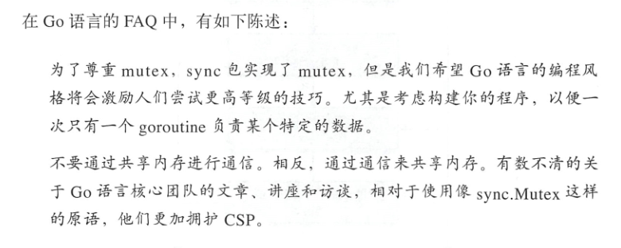
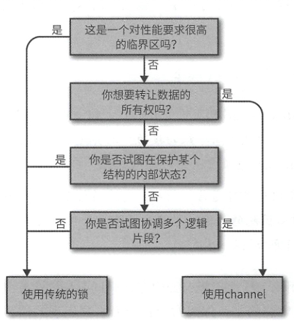

# Golang并发编程

## 一、并发模型

golang中的并发编程思想：

- 通过通信共享内存（CSP：Communication   Sequential [sɪˈkwenʃl] Process（通信顺序进程））
- 通过锁共享内存

Go 语言的并发性哲学可以这样总结 ：**追求简洁，尽量使用 channel ，并且认为goroutine 的使用是没有成本的**。

**在Channel和传统的锁之间如何选择？**

## 二、goroutine特性

## 三、channel相关

- channel如果关闭后，channel中的数据仍然可以读取出来，但是如果再对此channel进行写操作，会引发panic错误

- 如何判断一个channel中是否含有数据？

- 使用close函数关闭通道
- 数据不发送完，不应该关闭通道
- 已经关闭的channel，不能再向其写数据。如果向已经关闭的通道写数据，会报错。panic：send on closed channel
- 已经关闭的channel，可以从中读到数据0。读到0就说明：写端已经关闭了

