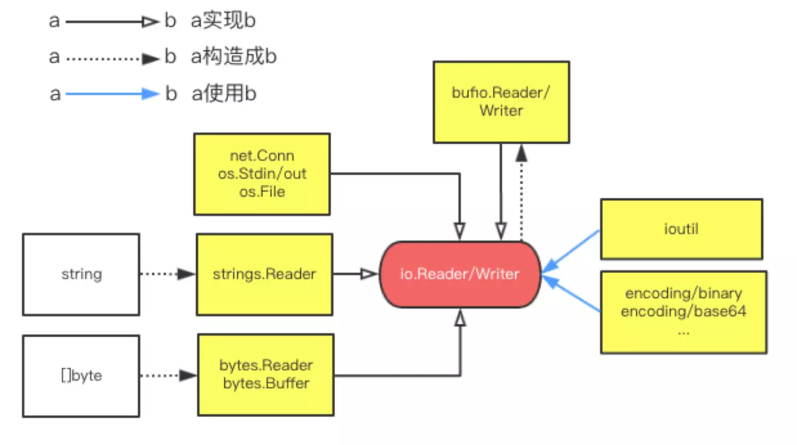

# Golang 文件读写IO

围绕`io.Reader/Writer`，有几个常用的实现：

- net.Conn, os.Stdin, os.File: 网络、标准输入输出、文件的流读取
- strings.Reader: 把字符串抽象成Reader
- bytes.Reader: 把`[]byte`抽象成Reader
- bytes.Buffer: 把`[]byte`抽象成Reader和Writer
- bufio.Reader/Writer: 抽象成带缓冲的流读取（比如按行读写）

参考资料：

- [Go编程技巧--io.Reader/Writer](https://www.jianshu.com/p/758c4e2b4ab8)