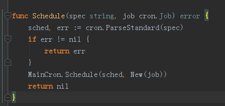

# jobrunner使用手册

地址：https://github.com/bamzi/jobrunner

## 安装使用
安装：`go get github.com/bamzi/jobrunner`


### 1、定义一个Job

job目录下放置的是单个任务，我们可以查看Shedule的源码：



其接收两个参数

- spec：定时规则，可以是cron表达式或者`@XXX`格式
- job ：job实例

对于job实例，必须实现Job接口，即实现Run()方法


例如定义一个打印时间的任务：

```go
import (
	"fmt"
	"time"
)
// 打印时间任务 实现了Job接口
type PrintTime struct{}

func (e PrintTime) Run() {
	fmt.Println("time:",time.Now())
}
```


### 2、启动

在main方法里执行

```go
	jobrunner.Start()  //默认10个线程池
	jobrunner.Schedule("@every 2s", job.PrintTime{})  //每两秒执行一次
	time.Sleep(time.Second*20)  //防止主协程提前结束，导致定时任务关闭
```

